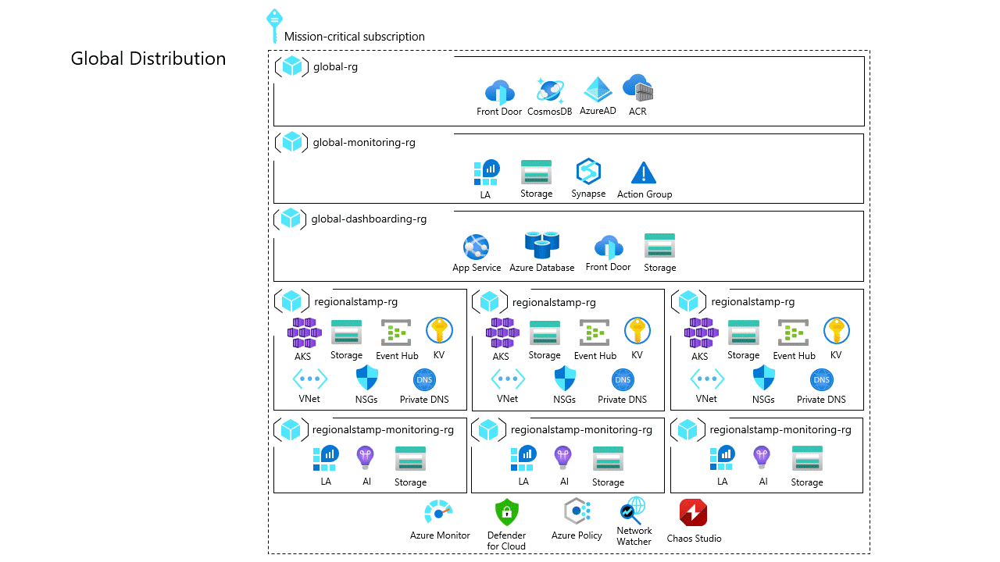
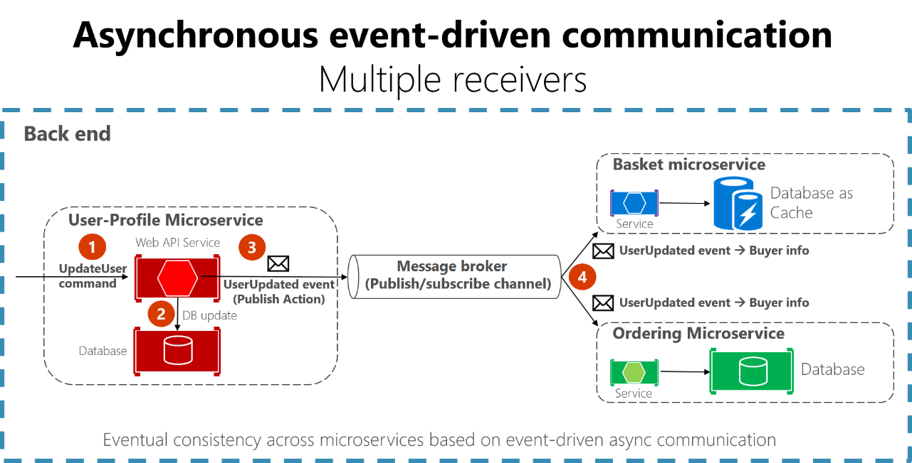

# Application design of mission-critical workloads

Both functional application requirements and non-functional requirements are critical to inform key design decisions for a mission-critical application design. However, these requirements should be examined alongside key cloud application design patterns to ensure aspirations are fully achieved. 

This design area explores the important application design patterns for building a highly reliable application on Azure.

## Scale-unit architecture

Architecturally, it is critical to optimize end-to-end scalability through the logical compartmentalization of operational functions at all levels of the application stack. For achieving a highly available application design, all functional aspects of the solution must be capable of scaling to meet changes in demand.

A _scale-unit_ is a logical unit or function that can be scaled independently. A unit can be code components, application hosting platforms, or even deployment stamps that encompass related components.

> [!TIP]
> For more information, see the [Deployment Stamps pattern](http://docs.microsoft.com/azure/architecture/patterns/deployment-stamp) for further details.

For example, the [Mission-Critical Online](https://github.com/azure/mission-critical-online) reference implementation considers a user flow for providing comments or product ratings on catalog items that use APIs for retrieving and posting comments or ratings, and supporting components such as an OAuth endpoint, datastore, and message queues. These stateless API endpoints for retrieving and posting results represent granular functional units that must be able to adapt to changes in demand. However, for these to be truly scalable, the underlying application platform must also be able to scale in-kind. Similarly, to avoid performance bottlenecks in the end-to-end user flow and to achieve sustainable scale, the downstream components and dependencies must also be able to scale to an appropriate degree, either independently, as a separate scale-unit, or together, as part of a single logical unit.

This image shows the multiple scale-unit scopes that are considered by this reference implementation user flow. These scopes range from microservice pods to cluster nodes and regional deployment stamps.

Using a scale-unit architecture is recommended to optimize the end-to-end scalability of a mission-critical application so that all levels of the solution can appropriately scale. The relationship between related scale-units, and the components inside a single scale-unit, should be defined according to a capacity model, taking into consideration non-functional requirements around performance.

### Design considerations

Here are some benefits of using a scale-unit architecture:

- The scale-unit architecture pattern goes great lengths to address scale limits of individual resources and the application as a whole.
  
- A scale-unit architecture helps with complex deployment and update scenarios, since an entire regional stamp can be deployed as one unit. This architecture allows you to test and validate specific versions of components together, prior to directing traffic to it.

- The scale-unit architectural pattern can also be applied to support multi-tenant requirements for customer segregation.

[Azure subscription scale limits and quotas](http://docs.microsoft.com/azure/azure-resource-manager/management/azure-subscription-service-limits) might have a bearing on application design, technology choices, and the definition of scale-units.

When designing a highly available architecture, start by asking these questions.

**How many requests is the solution required to support for each user flow? Are the usage patterns predictable?**

The expected peak request rate (requests per second) and daily/weekly/seasonal traffic patterns are critical to inform core scale requirements.
 
**Is traffic expected to grow? At what rate will it grow?**

The expected growth patterns for both traffic and data volume inform the design, about sustainable scale.

**Is a degraded service with high response times acceptable under load?**

The required performance of the solution under load is a critical decision factor when modeling required capacity.

### Design recommendations

- Define a scale-unit when the scale-limits of a single deployment are likely to be exceeded.

- Ensure all application components are able to scale, either as independent scale-units or as part of a logical scale-unit that encompasses multiple related components.

- Define the relationship between scale-units, according to a capacity model and non-functional requirements.

- Define a regional deployment stamp to unify the provisioning, management, and operation of regional application resources, into a heterogenous but inter-dependent scale-unit.

  As the load increases, extra stamps can be deployed within the same or different Azure regions, in order to horizontally scale the solution.

> [!NOTE]
> When deploying within an Azure landing zone, ensure the landing zone subscription is dedicated to the application, in order to provide a clear management boundary and to avoid potential the [Noisy Neighbor antipattern](http://docs.microsoft.com/azure/architecture/antipatterns/noisy-neighbor).

- For high-scale application scenarios with significant volumes of traffic, design the solution to scale across multiple Azure subscriptions, to ensure the inherit scale-limits within a single subscription don't constrain the scalability.

  Define a subscription-scoped deployment as a scale-unit to avoid a 'spill-and-fill' subscription model.
    - Deploy each regional deployment stamp within a dedicated subscription, in order to ensure the subscription limits only apply within the context of a single deployment stamp and not across the application as a whole. Where appropriate, multiple deployment stamps can be considered within a single region, but you should deploy them across independent subscriptions.
    - Separate the 'global' shared resources within a dedicated subscription to allow for consistent regional subscription deployment. Avoid using a specialized deployment for a primary region.

> [!IMPORTANT]
> The use of multiple subscriptions necessitates additional CI/CD complexity, which must be appropriately managed. Therefore, it's only recommended in extreme scale scenarios, where the limits of a single subscription are likely to become a hindrance.

- Where multiple production subscriptions are needed to ensure requisite scale, consider using a dedicated application management group, to simplify policy assignment through a policy aggregation boundary.

- Deploy any considered environments, such as production, development, or test environments, into separate subscriptions. This practice ensures that lower environments don't contribute towards scale limits, and it reduces the risk of lower environment updates polluting production, by providing a clear management and identity boundary.

- Define and analyze non-functional requirements, such as the availability SLO, within the context of key end-to-end user-flows. Technical and business scenarios will likely have distinct considerations for resilience, availability, latency, capacity, and observability. This practice will allow for relative flexibility in the design approach, tailoring design decisions and technology choices at a user-flow level, since one size may not fit all.

- Model the required capacity around identified traffic patterns, in order to ensure sufficient capacity is provisioned at peak times and to prevent service degradation. Use traffic patterns to optimize capacity and resource utilization, during periods of reduced traffic.

- Measure the time it takes to perform scale-out and scale-in operations, in order to ensure that the natural variations in traffic don't create an unacceptable level of service degradation.   - To drive continuous improvement, track the scale operation durations as an operational metric.

### Example - Subscription scale-unit approach

This image demonstrates how the single subscription reference deployment model can be expanded across multiple subscriptions, in an extreme scale scenario, to navigate subscription scale-limits.

## Global distribution

Failure is impossible to avoid in any highly distributed environment. So, always plan for failure.

Here are some strategies to mitigate many fault scenarios.

- [Availability Zones](http://docs.microsoft.com/azure/availability-zones/az-overview#availability-zones) (AZ) allows highly available regional deployments across different data centers within a region. Nearly all Azure services are available in either a zonal configuration (where service is pinned to a specific zone) or zone-redundant configuration (where the platform automatically ensures the service spans across zones and can withstand a zone outage). These configurations allow for fault-tolerance up to a datacenter level.

- To maximize reliability, consider using multiple Azure regions to ensure regional fault tolerance, so that application availability remains even when an entire region goes down. When designing a multi-region application, consider different deployment strategies, such as active-active and active-passive, alongside application requirements, because there are significant trade-offs between each approach.

An active-active deployment strategy represents the gold standard because it maximizes availability and allows for higher composite  Service Level Agreement (SLA). While active-active is the recommended approach, it can introduce challenges around data synchronization and consistency for many application scenarios, and these challenges must be fully addressed at a data platform level, with other trade-offs, from increased cost exposure and increased engineering effort.

Not every workload supports or requires multiple regions running simultaneously, and hence the precise application requirements should be weighed against these trade-offs to inform an optimal design decision. For certain application scenarios with lower reliability targets, different deployment models, such as active-passive or sharding, can be suitable alternatives.

It's important to note that some Azure services are deployable or configurable as global resources, which aren't constrained to a particular Azure region. So, when accommodating both 'Scale-Unit Architecture' and 'Global Distribution', carefully consider to how resources are optimally distributed across Azure regions. 

This image shows the high-level active-active design. A user accesses the application through a central global entry point that then redirects requests to a suitable regional deployment stamp.

### Design considerations

- Not all services or capabilities are available in every Azure region, and so there can be service availability implications depending on the selected deployment regions.  - For example, [Availability Zones](http://docs.microsoft.com/azure/availability-zones/az-region) aren't available in every region.

- Azure regions are grouped into [regional pairs](http://docs.microsoft.com/azure/best-practices-availability-paired-regions) consisting of two regions within the same geography. Some Azure services use paired regions to ensure business continuity and to protect against data loss. For example, Azure Geo-redundant Storage (GRS) replicates data to a secondary paired region automatically, ensuring that data is durable if the primary region isn't recoverable. If an outage affects multiple Azure regions, at least one region in each pair will be prioritized for recovery.

- The [Azure Safe Deploy Practice (SDP)](https://azure.microsoft.com/blog/advancing-safe-deployment-practices) ensures all code and configuration changes (planned maintenance) to the Azure platform undergo a phased roll-out, with health analyzed in case any degradation is detected during the release.  After the Canary and Pilot phases have  successfully completed, platform updates are serialized across regional pairs, ensuring that only one region in each pair is updated at a time.

- Like any cloud provider, Azure ultimately has a finite amount of resources and as a result there are situations that can lead to the unavailability of capacity in individual regions. In the event of a regional outage there will be a significant increase in demand for resources within the paired region as impacted customer workloads seek to recover within the paired region. In certain scenarios this may create a capacity challenge where supply temporarily does not satisfy demand.

When designing a globally distributed architecture, start with these questions.

**Are there specific regions where data must reside or where resources have to be deployed?**

Compliance requirements around geographical data residency, data protection, and data retention can have a significant bearing on appropriate geographical distribution.

**Where are the requests physically originating from?**

The geographic proximity and density of users or dependent systems should inform design decisions around the global distribution.

**Are users going to connect from home and/or organizational networks? Can all users be expected to have fast internet connections?**

The connectivity method by which users or systems access the application, whether over the public Internet or private networks using either VPN or Express Route connectivity.

- Different Azure regions have slightly different cost profiles for some services. There may be further cost implications depending on the precise deployment regions chosen.

- Availability Zones have a latency perimeter of less than 2 milliseconds between availability zones.
  - For workloads that are particularly 'chatty' across zones this latency can accumulate to form a non-trivial performance penalty, as well as incurring bandwidth charges for inter-zone data transfer.

- An active-active deployment across Azure and other cloud providers can be considered to further mitigate reliance on global dependencies within a single cloud provider. A multi-cloud active-active deployment strategy introduces a significant amount of complexity around CI/CD, given the significant difference in resource specifications and capabilities between cloud providers. This necessitates specialized deployment stamps for each cloud.  

### Design recommendations

- Deploy the solution within a minimum of two Azure regions to protect against regional outages. Prioritize the use of paired regions to benefit from SDP risk mitigations and platform recovery capabilities.
  > [!IMPORTANT]
  > For scenarios targeting a >= 99.99% SLO, a minimum of three deployment regions is recommended to maximize the composite SLA and overall reliability.

- Use an active-active deployment strategy where possible to maximize reliability.

  Where data/state consistency challenges exist explore the use of a globally distributed data store, stamped regional architecture, a partially active-active deployment, where some components are active across all regions while others are located centrally within a primary region.

- Calculate the [composite SLA](http://docs.microsoft.com/azure/architecture/framework/resiliency/business-metrics#composite-slas) for all user flows. Ensure the composite SLA is in-line with business targets.

- Deploy additional regional deployment stamps to achieve a greater composite SLA. The use of global resources will constrain the increase in composite SLA from adding further regions.

- Define and validate the recovery point objectives (RPO) and recovery time objectives (RTO).

- Geographically co-locate Azure resources with users to minimize network latency and maximize end-to-end performance.
  - Technical solutions such as a Content Delivery Network (CDN) or edge caching can also be used to drive optimal network latency for distributed user bases.

- For high-scale application scenarios with significant volumes of traffic, design the solution to scale across multiple regions to navigate potential capacity constraints within a single region.

- Select deployment regions that offer requisite capabilities and characteristics to achieve performance and availability targets, while fulfilling data residency and retention requirements. 

  Within a single geography, prioritize the use of regional pairs to benefit from SDP serialized rollouts for planned maintenance, and regional prioritization in the event of unplanned maintenance.
  
- It's not uncommon that data compliance requirements will constrain the number of available regions and potentially force design compromises. In such cases, additional investment in operational wrappers is highly recommended to predict, detect, and respond to failures.
  - If only a single Azure region is suitable, multiple deployment stamps ('regional scale-units') should be deployed within the selected region to mitigate some risk, using Availability Zones to provide datacenter-level fault tolerance. However, such a significant compromise in geographical distribution will drastically constrain the attainable composite SLA and overall reliability.
  - If suitable Azure regions do not all offer requisite capabilities, be prepared to compromise on the consistency of regional deployment stamps to prioritize geographical distribution and maximize reliability.
    - For example, when constrained to a geography with two regions where only one region supports Availability Zones (3 + 1 datacenter model), create a secondary deployment pattern using fault domain isolation to allow for both regions to be deployed in an active configuration, ensuring the primary region houses multiple deployment stamps.

- Align current service availability with product roadmaps when selecting deployment regions; not all services may be available in every region on day 1.

- Use Availability Zones where possible to maximize availability within a single Azure region.

### Example - Global distribution approach

The Mission-Critical reference implementations consist of both global and regional resources, with regional resources deployed across multiple regions to provide geo-availability, in the case of regional outages and to bring services closer to end-users. These regional deployments also serve as scale-unit "stamps" to provide additional capacity and availability when required.

## Loosely coupled event-driven architecture

Loose coupling provides the cornerstone of a microservice architecture by allowing services to be designed in a way that each service has little or no knowledge of surrounding services. The _loose_ aspect allows a service to operate independently. The coupling aspect allows for inter-service communication through well-defined interfaces. In the context of a mission critical application it further facilitates high-availability by preventing downstream failures from cascading to frontends or different deployment stamps. 

Evaluate these key characteristics of loose coupling for application design:

- Services aren't constrained to use the same compute platform, programming language, runtime, or operating system.
- Services can scale independently, optimizing the use of infrastructure and platform resources.
- Failures can be handled separately and don't affect client transactions.
- Transactional integrity is harder to maintain because data creation and persistence happens within separate services.
- End-to-end tracing requires more complex orchestration.

When implementing loose coupling, **event-driven architecture** and **asynchronous message processing** are key design patterns for interactions which don't require an immediate response. Events indicate a change in state within entities and are generated by event *producers*. Producers don't know anything about how events should be processed or handled. That is the responsibility of *consumers*. When using asynchronous event-driven communication, a producer publishes an event when something happens within its domain, which another component needs to be aware of. An example would be a price change in a product catalog, which consumers will subscribe to receive so they can process the event asynchronously.

> [!TIP]
> Refer to the [event-driven architecture](http://docs.microsoft.com/azure/architecture/guide/architecture-styles/event-driven) and [asynchronous processing](http://docs.microsoft.com/azure/architecture/patterns/async-request-reply) patterns for further details.

In reality, applications can combine loose and tight-coupling, depending on business objectives. 

### Design considerations

- Not all content that a solution makes available over the Internet is generated dynamically. Applications serve both static assets (images, JavaScript, CSS, localization files, etc.) and dynamic content.
  - Workloads with frequently accessed static content benefit greatly from caching since it reduces the load on backend services and reduces content access latency for end users.

- Caching can be implemented natively within Azure using either Azure Front Door or Azure Content Delivery Network (CDN).
  - [Azure Front Door](http://docs.microsoft.com/azure/frontdoor/front-door-caching) provides Azure-native edge caching capabilities and routing features to divide static and dynamic content.
    - By creating the appropriate routing rules in Azure Front Door, `/static/*` traffic can be transparently redirected to static content.
  - More complex caching scenarios can be implemented using the [Azure CDN](https://azure.microsoft.com/services/cdn) service to establish a full-fledged content delivery network for significant static content volumes.
    - The Azure CDN service will likely be more cost effective, but does not provide the same advanced routing and Web Application Firewall (WAF) capabilities which are recommended for other areas of an application design. It does, however, offer further flexibility to integrate with similar services from third-party solutions, such as Akamai and Verizon.
  - When comparing the Azure Front Door and Azure CDN services, the following decision factors should be explored:
    - Can required caching rules be accomplished using the rules engine.
    - Size of the stored content and the associated cost.
    - Price per month for the execution of the rules engine (charged per request on Azure Front Door).
    - Outbound traffic requirements (price differs by destination).

### Design recommendations

- Key functionality should be deployed and managed as independent loosely coupled microservices with event-driven interaction through well-defined interfaces (synchronous and asynchronous).
  - The definition of microservice boundaries should consider and align with critical user-flows.

- Use event-driven asynchronous communication where possible to support sustainable scale and optimal performance.

- Separate the delivery of static and dynamic content to users and deliver relevant content from a cache to reduce load on backend services optimize performance for end-users.

- Given the strong recommendation ([Network and connectivity](./mission-critical-networking-connectivity.md) design area) to use Azure Front Door for global routing and Web Application Firewall (WAF) purposes, it's recommended to prioritize the use of Azure Front Door caching capabilities unless gaps exist.

### Example - Event-driven approach

The [Mission-Critical Online](https://github.com/Azure/Mission-Critical-online) reference implementation uses microservices to process a single business transaction. It applies write operations asynchronously with a message broker and worker, while read operations are synchronous with the result directly returned to the caller.

## Application-level resiliency patterns and error handling

A mission-critical application must be developed with resiliency in-mind. It is therefore critical that application code be designed and developed to be resilient, ensuring that the application can respond to failure, which is ultimately an unavoidable characteristic of highly distributed multi-tenant cloud environments like Azure.

More specifically, all application components should be designed from the ground-up to apply key resiliency patterns for self-healing, such as [retries with back-off](http://docs.microsoft.com/dotnet/architecture/microservices/implement-resilient-applications/implement-http-call-retries-exponential-backoff-polly) and [circuit breaker](http://docs.microsoft.com/dotnet/architecture/microservices/implement-resilient-applications/implement-circuit-breaker-pattern). Such patterns go great lengths to transparently handle transient faults such as network packet loss, or the temporary loss of a downstream dependency. So, the application code should address as many failure scenarios as possible in order to maximize service availability and reliability.

When issues are not transient in-nature and cannot be fully mitigated within application logic, it becomes the role of the health model and operational wrappers to take corrective action. However, for this to happen effectively, it is essential that the application code incorporates proper instrumentation and logging to inform the health model and facilitate subsequent troubleshooting or root cause analysis when required. More specifically, application code should be implemented to facilitate [distributed tracing](http://docs.microsoft.com/dotnet/core/diagnostics/distributed-tracing-concepts), by providing the caller with a comprehensive error message that includes a correlation ID when a failure occurs.

Tools like [Azure Application Insights](http://docs.microsoft.com/azure/azure-monitor/app/distributed-tracing) can help significantly to query, correlate, and visualize application traces.

### Design considerations

- Vendor-provided SDKs, such as the Azure service SDKs, will typically provide built-in resiliency capabilities like retry mechanisms.

- It's not uncommon for application responses to transient issues to cause cascading failures.
  
  For example, retry without appropriate back-off will exacerbate when a service is being throttled will likely exacerbate the issue.

- Retry delays can be linearly spaced, or increase exponentially to 'backoff' via growing delays.

Here are some other resiliency-related patterns:

|Pattern|Summary|
|---|---|
|[Queue-Based Load Leveling](http://docs.microsoft.com/azure/architecture/patterns/queue-based-load-leveling)| Introduces a buffer between consumers and requested resources to ensure consistent load levels. As consumer requests are enqueued, a worker process dequeues the requests and processes them against the requested resource at a pace set by the worker and the requested resource's ability to process the requests. If consumers expect replies to their requests, a separate response mechanism will also need to be implemented.|
|[Circuit Breaker](http://docs.microsoft.com/azure/architecture/patterns/circuit-breaker)| Provides stability by either waiting for recovery, or quickly rejecting requests rather than blocking while waiting for an unavailable remote service or resource.|
|[Bulkhead](http://docs.microsoft.com/azure/architecture/patterns/bulkhead)|Strives to partition service instances into groups based on load and availability requirements, isolating failures to sustain service functionality.|
|[Saga](http://docs.microsoft.com/azure/architecture/reference-architectures/saga/saga)| Manage data consistency across microservices with independent datastores by ensuring services update each other through defined event or message channels. Each service performs local transactions to update its own state and publishes an event to trigger the next local transaction in the saga. If a service update fails, the saga executes compensating transactions to counteract preceding service update steps. Individual service update steps can themselves implement resiliency patterns, such as retry.|
|[Health Endpoint Monitoring](http://docs.microsoft.com/azure/architecture/patterns/health-endpoint-monitoring)|Implement functional checks in an application that external tools can access through exposed endpoints at regular intervals.|
|[Retry](http://docs.microsoft.com/azure/architecture/patterns/retry)|Handles transient failures elegantly and transparently.|
|[Circuit Breaker](http://docs.microsoft.com/azure/architecture/patterns/circuit-breaker)|Handles faults that might take a variable amount of time to recover from when connecting to a remote service or resource.|
|[Throttling](http://docs.microsoft.com/azure/architecture/patterns/throttling)| Controls the consumption of resources used by application components, protecting them from becoming over encumbered. When a resource reaches a load threshold, it should safeguard its availability by deferring lower-importance operations and degrading non-essential functionality so that essential functionality can continue until sufficient resources are available to return to normal operation.|

### Design recommendations

- Design and develop application code to anticipate and handle failures.

- Use vendor provided SDKs, such as the Azure SDKs, to connect to dependent services.
  - Use the resiliency capabilities provided by utilized SDKs instead of reimplementing resiliency functionality.
  - Ensure a suitable back-off strategy is applied when retrying failed dependency calls to avoid a self-inflicted DDoS scenario.

- Define **common engineering criteria** for all application microservice teams to drive consistency and acceleration regarding the use application-level resiliency patterns.
  - Developers should familiarize themselves with [common software engineering patterns](http://docs.microsoft.com/azure/architecture/patterns/) for resilient applications.

- Implement resiliency patterns using proven standardized packages, such as [Polly for C#](http://www.thepollyproject.org/) or [Sentinel for Java](https://github.com/alibaba/Sentinel).

- Implement [Health Endpoint Monitoring](http://docs.microsoft.com/azure/architecture/patterns/health-endpoint-monitoring) by exposing functional checks within application code through health endpoints which external monitoring solutions can poll to retrieve application component health statuses. Responses should be interpreted alongside key operational metrics to inform application health and trigger operational responses, such as raising an alert or performing a compensating roll-back deployment.

- Implement [Queue-Based Load Leveling](http://docs.microsoft.com/azure/architecture/patterns/queue-based-load-leveling) by applying a prioritized ordering so that the most important activities are performed first.

- Implement the [Retry](http://docs.microsoft.com/azure/architecture/patterns/retry) pattern to enable application code to handle transient failures elegantly and transparently.
  - Cancel if the fault is unlikely to be transient and is unlikely to succeed if the operation is reattempted.
  - Retry if the fault is unusual or rare and the operation is likely to succeed if attempted again immediately.
  - Retry after a delay if the fault is caused by a condition that may need a short time to recover, such as network connectivity or high load failures.
    - Apply a suitable 'backoff' strategy with growing retry delays.

- Use correlation IDs for all trace events and log messages to tie them to a given request.
  - Return correlation IDs to the caller for all calls not just failed requests.

- Use [structured logging](https://stackify.com/what-is-structured-logging-and-why-developers-need-it/) for all log messages.

- Select a unified operational data sink for application traces, metrics, and logs to enable operators to seamlessly debug issues.
  - Ensure operational data is used in conjunction with business requirements to inform an [application health model](./mission-critical-health-modeling.md).

## Next step

Review the considerations for the application platform.

> [!div class="nextstepaction"]
> [Application platform](./mission-critical-application-platform.md)

